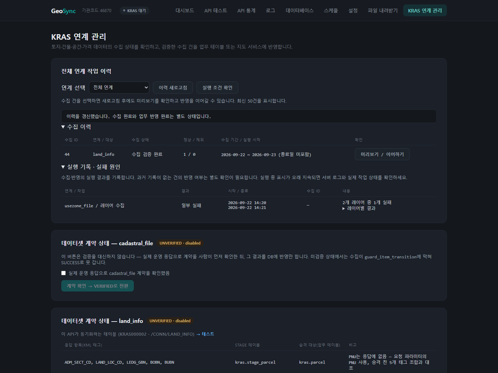
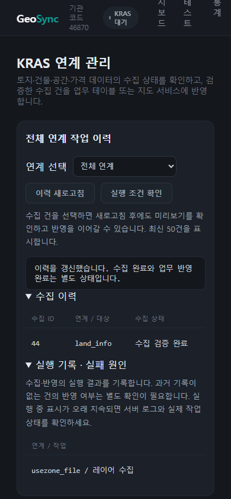

# KRAS 연계 관리 1차 구현 결과

- 작성일: 2026-09-22
- 기준: [기능 추가 및 개선 제안](./kras-integration-improvement-recommendations.md)의 1차 작업
- 작업 브랜치: `feat/kras-integration-phase1`
- 상태: 코드 구현 및 아래 검증 완료. 실제 KRAS 신규 수집·운영 반영은 실행하지 않았다.

## 1. 구현한 기능

| 항목 | 구현 내용 |
|---|---|
| 전체 연계 수집 이력 | 현재 기관의 모든 데이터셋을 조회하고 데이터셋으로 필터링한다. 기본 최신 50건, API 조회 한도 100건이다. |
| 독립적인 실행 기록 | 수집·반영·용도지역 순회·발행 실행을 `kras.ui_operation_log`에 기록한다. 적재 트랜잭션 롤백 후에도 실패 기록을 남긴다. |
| 요청 대상 식별 | PNU, 조회 기간, 카탈로그 ID, 릴리즈 ID를 해당 작업의 요청 요약으로 남긴다. 추가 파라미터 JSON과 응답 미리보기는 실행 로그에 복제하지 않는다. |
| 반영 이어하기 | PNU·기간·토지기본 TXT 수집 건을 이력에서 선택하고 stage 미리보기 확인 후 반영한다. 새로고침 후에도 다시 선택할 수 있다. |
| 조회 제한 | 미리보기는 서버에 등록된 매퍼의 stage 및 자식 stage 테이블만 조회한다. 테이블별 100행까지만 표시하고 초과 여부를 안내한다. |
| 반영 조건 | 현재 기관, 요청 데이터셋, SUCCESS 상태를 서버에서 재확인한다. PNU·기간·TXT 서비스의 반영 조회에도 데이터셋 조건을 추가했다. |
| 실행 전 점검 | 데이터셋 등록·검증·활성화·서비스 ID 및 매퍼와의 ID 일치를 점검한다. PNU 형식·기관 일치와 알려진 건물 조회 서비스의 필수 식별번호를 검사한다. |
| 입력 오류 | 추가 파라미터는 문자열 값을 가진 JSON 객체만 허용한다. 기간 순서·최대 조회 일수 검사는 기존 수집 서비스를 재사용한다. |
| 부분 실패 표시 | 용도지역 순회를 완료·일부 실패·실패로 분류한다. 레이어별 실패 사유를 화면과 실행 로그에 남긴다. |
| 상태 갱신 | 용도지역 작업 후 게시 건수와 릴리즈 상태·레이어 표만 갱신해 결과 메시지를 보존한다. 수동 진행상태 새로고침 버튼도 제공한다. |
| 화면 정리 | 메뉴명을 “KRAS 연계 관리”로 바꾸고 통합 이력을 상단에 추가했다. 좁은 화면에서는 이력 표를 가로 스크롤한다. |

수집 SUCCESS는 업무 반영 완료를 의미하지 않는다. 업무 반영은 실행 기록의 PROMOTE 결과를 별도로 확인한다. 도입 이전 반영 이력이 없는 수집 건은 반영 여부를 단정하지 않는다.

공간 데이터의 과거 item을 이력에서 직접 반영하는 기능은 제공하지 않는다. 기존 공간 데이터 카드의 카탈로그·릴리즈·지도 반영 절차를 사용한다. 공시지가 전체 TXT는 별도 업무 반영 단계가 없다.

## 2. 함께 수정한 기존 문제

- 선언형 매퍼 카드의 `th:attr` 버튼 표현식이 Thymeleaf 렌더링을 실패시키는 문제를 수정했다. 슬러그를 `data-slug`로 전달한다.
- 수집 전 반영 버튼의 `th:disabled`가 정적 `disabled`를 제거하는 문제를 수정했다. 반영할 작업이 선택된 뒤에만 버튼을 활성화한다.
- TXT 재수집 실패 후 이전 성공 건의 ID가 남아 반영 버튼을 활성화하는 문제를 수정했다.
- 용도지역 일부 실패 결과를 성공 색상으로 표시하고 자동 페이지 이동으로 지워 버리던 동작을 수정했다.

## 3. 배포 및 DB 영향

### 추가 테이블

[`conf/sql/kras-ui-operation-log.sql`](../../../conf/sql/kras-ui-operation-log.sql)에 추가 테이블 DDL을 제공한다. 기존 업무 테이블, DB 가드 및 기존 스케줄은 변경하지 않는다.

- 첫 수집·반영 요청 시 실행 기록 테이블이 없으면 애플리케이션이 생성한다.
- DDL 권한이 없는 운영 계정은 관리자가 SQL을 먼저 적용하고 운영 계정에 테이블 SELECT/INSERT/UPDATE와 시퀀스 USAGE 권한을 부여해야 한다.
- 실행 시작 기록을 저장하지 못하면 수집·반영을 시작하지 않는다.
- 작업 성공 후 종료 기록만 저장하지 못한 경우에는 작업 성공 결과를 유지하고 별도의 이력 저장 경고를 반환한다. 자동 재실행하지 않는다.
- 목록 조회만으로 테이블을 생성하지 않는다. 테이블이 없는 상태에서도 기존 `sync_item` 수집 이력을 조회한다.

### 사용 흐름

1. `/kras-db`의 전체 연계 작업 이력에서 데이터셋을 선택한다.
2. “실행 조건 확인”으로 검증·활성화·서비스 ID 상태를 확인한다.
3. 필요한 경우 기존 수집 카드에서 수집한다.
4. 수집 이력의 “미리보기 / 이어하기”를 누른다.
5. 데이터셋, 작업 ID, 수집 기간 및 미리보기를 확인한다.
6. “선택한 수집 건 업무 테이블 반영”을 누르고 확인한다.
7. 실행 기록에서 반영 결과 또는 실패 원인을 확인한다.

## 4. 검증 결과

| 검증 | 결과 |
|---|---|
| 변경 전 `gradlew.bat test` | 45개 중 44개 통과, 기존 `DatabaseDefaultsTest.resolvesApprovedPostgresDefaultsWithoutEnvironmentOverrides` 실패 |
| 변경 후 `gradlew.bat test` | 59개 중 58개 통과. 실패는 변경 전과 동일한 1개이며 새 테스트 14개는 모두 통과 |
| `gradlew.bat bootJar` | 성공 |
| Thymeleaf 렌더링 테스트 | 실제 템플릿과 레이아웃을 렌더링해 통합 이력 및 선언형 매퍼 버튼 검증 |
| Playwright / Edge | 새로고침 후 이력 선택·반영, 용도지역 부분 실패 및 상태 갱신, TXT 재수집 실패 후 이전 ID 차단, 초기 버튼 상태 검증 통과 |
| JavaScript 구문 검사 | `node --check src/main/resources/static/js/kras-history.js` 통과 |
| 변경 파일 공백 검사 | `git diff --check` 통과 |

새 테스트는 이력 범위·조회 한도, 미검증 실행 차단, PNU 입력, 요청 식별 기록, 실패 기록, 부분 결과 분류, 로그 종료 저장 실패, 반영 데이터셋 격리 및 화면 렌더링을 검증한다. DB 경계는 테스트 대역을 사용했다. 브라우저는 실제 렌더링 HTML을 사용하고 API 응답은 통제된 테스트 데이터로 제공했다. 운영 데이터로 새 기능의 전체 흐름을 검증한 것은 아니다.

브라우저 테스트 재실행 예시(PowerShell, 저장소 루트):

```powershell
.\gradlew.bat test --tests geosync.kras.KrasIntegrationViewTest
npm.cmd install --prefix build/kras-ui-tools playwright --no-audit --no-fund
$env:PLAYWRIGHT_MODULE = (Resolve-Path build/kras-ui-tools/node_modules/playwright).Path
node src/test/js/kras-history.browser.cjs
```

Microsoft Edge가 설치되어 있어야 한다. 테스트 도구와 HTML 출력은 `build/` 아래에만 생성된다.

## 5. 검토 및 남은 범위

별도 코드 검토에서 확인한 안내 문구 인코딩 문제와 용도지역 상태 갱신 누락을 수정했다. 실패 요청 식별이 어렵다는 지적에 따라 요청 요약도 추가했다.

- 실행 조건 확인은 등록·검증·활성화·서비스 ID 중심이다. DB 연결 실패는 요청 오류로 안내하고, 선행 업무 데이터의 상세 누락 사유는 기존 반영 단계와 DB 가드에서 처리한다.
- 실패 작업을 동일한 추가 파라미터까지 복원해 자동 재시도하는 기능은 아직 없다. 대상 요약과 오류를 확인하고 기존 수집 카드에서 재실행한다.
- 비동기 실행, 실시간 처리 단계·진행률, 서버 재시작 후 중단 작업 자동 판정은 후속 작업이다. 오래 남은 RUNNING은 실제 작업과 종료 기록 상태를 확인해야 한다.
- 전체 화면의 분류·검색 개편, 검증 근거 관리, 반영 전 변경 비교는 2차 범위다.
- 입력 도우미, 선행 조회 연결, 예약·다건 수집·자동 재시도는 3차 범위다.
- 모바일 이력 표는 대응했으나 기존 공통 상단 메뉴의 작은 화면 배치는 후속 UI 개선 범위다.

## 6. 화면

아래 화면은 테스트 데이터로 생성했으며 실제 운영 기록이 아니다.




