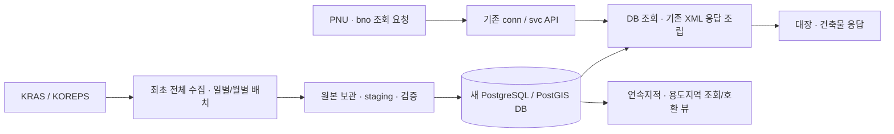
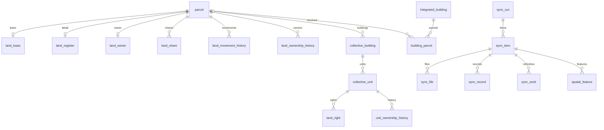

# KRAS·KOREPS 조회 API 대체 DB 및 일별·월별 동기화 설계

작성일: 2026-09-11  
상태: 검토용 설계. 애플리케이션·운영 DB에는 적용하지 않음.

## 1. 설계 기준과 결론

원본은 `docs/reference/kras.hwp`의 **차세대 부동산종합공부시스템 연계가이드, 2025.04.17**이다. HWP BodyText를 추출하여 제Ⅱ장 1~16절의 항목표와 XML·TXT 예시를 확인했다. 아래 절·쪽 번호는 문서 목차 기준이다. 문서에 없는 제약은 원천의 확정 규격으로 간주하지 않는다.

목표는 **현재 프로그램의 PNU 기반 대장·건축물 API 응답과 연속지적·용도지역 DB 동기화를 새 DB로 대체**하는 것이다. 기존 `/conn/*`, `/conn/*/body`, `/svc/*`의 요청·XML 응답 계약은 유지하고, 정상 조회 경로의 데이터 공급원을 외부 실시간 API에서 로컬 DB로 전환한다. 외부 KRAS/KOREPS는 초기 적재 및 일별·월별 배치의 수집원으로 사용한다.

단일 PostgreSQL/PostGIS DB에서 **업무 데이터 + API 응답용 게시 데이터 + 원천 연혁 + 수집 원본 + 동기화 제어**를 분리한다. 일별·월별 실행은 같은 업무 테이블에 반영하고, 실행 주기와 수집 범위는 별도 관리한다. DB 미수집을 원천의 데이터 없음으로 취급하지 않으며, 조회 중 외부 API를 자동 호출하는 폴백은 기본 구조에 포함하지 않는다.



HWP 16개 서비스뿐 아니라 `GatewayPaths.java`의 KRAS 14개·KOREPS 5개 경로와 `KrasGmxController.java`의 조합을 대체 범위로 삼는다. HWP에 없는 기존 서비스는 저장소 mock XML로 응답 계층과 후보 컬럼을 파악했으며, mock을 운영 규격으로 확정하지 않는다. 특히 HWP의 집합건물 대지권/건물통합정보는 기존 건축물대장 표제부·전유부와 서로 다른 데이터다.

기본 운영안은 일별 변경 대상 재조회와 월 1회 전체 대사다. 일별·월별 주기는 데이터셋별로 선택할 수도 있다. 월말 시점 데이터를 별도 보관하는 기능은 월별 실행과 다른 요구이며 기본 필수 범위에 포함하지 않는다.

검토한 방식:

| 방식 | 장점 | 한계 | 판단 |
|---|---|---|---|
| 매번 전체 삭제·재적재 | 구현이 단순 | 상세 조회 비용이 크고 실패·삭제 판정에 취약 | 검증된 SHAPE 전체 교체에 한정 |
| 현재 데이터 + 변경 조회 + 주기적 전체 대사 | 조회 성능, 누락 복구, 재시도 가능 | 실행 범위와 완료 상태 관리 필요 | 권장 |
| 매일 모든 업무 테이블 스냅샷 | 수집 시점별 비교가 쉬움 | 저장량·개인정보 복제 증가, 원천 과거시점 보장과 별개 | 월말 보관 요구가 있을 때 추가 |

## 2. 원본 문서에서 확인한 제약

| 근거 | 확인 내용 | 설계 반영 |
|---|---|---|
| 제Ⅱ장 1절, p.4 | 필지 식별 항목 5개, 표시·소유·기타정보, 소유내역 포함/불포함 옵션 | 필지 기본·상세·소유정보 분리, 미제공 상태 별도 관리 |
| 2절, p.7 | 공유인 반복, 공유순번, 말소자 포함 조회 | 공유인 1:N, 말소일 보존 |
| 4~6절, p.11~17 | 필지→집합건물→동·층·호·실→대지권 및 소유연혁 | 건물·전유부·대지권을 별도 테이블로 관리 |
| 7~9절, p.18~23 | 필지 및 집합건물의 연혁 반복 반환 | 원천 연혁을 현재값과 분리 |
| 10~11절, p.24~27 | 처리일자 시작·종료, 시작일 기준 10일 내 제공 | 일 단위 수집과 장기 누락 구간 분할 |
| 11~12절, p.26~29 | 소유권/집합건물 소유권 변동 항목표와 예시가 토지이동 항목을 반복 | 두 서비스의 상세 계약 확정 보류; 토지이동 파서 재사용 금지 |
| 13절, p.30 | UFID, PNU, 건물 속성, 관련지번 반복 | 통합건물과 관련 필지 관계 분리 |
| 14절, p.34 | 건물통합도면은 이미지 | 파일 메타데이터 저장, geometry로 해석하지 않음 |
| 15절, p.35 | 매일 갱신되는 시군구 전체 SHAPE, SHP/DBF/SHX | 기관·레이어 단위 전체 검증 후 교체 |
| 16절, p.36 | 토지기본 TXT는 8항목, 구분자 ASCII 11 | `0x0B` 전용 파싱 및 8열 검증 |

추가 주의점:

- 문서에는 실제 서비스 ID 값, 날짜 요청 파라미터의 영문 이름, 페이지 처리 규칙이 없다. 기존 `KRAS0000xx` 코드와 새 규격의 대응은 운영 응답으로 검증해야 한다.
- 15절이 참조하는 “24. 레이어목록 조회”는 제공된 문서에 없다. 레이어별 DBF 필드·좌표계는 이 문서만으로 확정할 수 없다.
- 12절에는 10일 제한 문구가 없다. 동일 제한이라고 단정하지 않고, 기본 수집 단위를 1일로 통일한다.
- `VARCHAR(8)` 날짜의 예시에 `1986-11-10`이 있고 건물 면적·비율 예시는 소수 4자리·9자리다. 표의 길이만으로 잘라 저장하지 않는다.
- 공시지가 개별값은 1절에 있으나 공시지가 전체 다운로드·용도지역 상세 규격은 없다. 기존 기능으로 유지하되 이 문서에서 확인된 규격과 구분한다.

## 3. DB 배치와 공통 규칙

### 3.1 스키마

신규 **`kras` 스키마**를 생성해 연계한다. DB 연결은 기존 단일 PostgreSQL 연결을 유지하고, 신규 업무·API 응답·공간·동기화 관리 테이블을 모두 `kras`에 둔다. 이하 표의 이름은 `스키마.테이블` 형식이다. 테이블에는 중복되는 `kras_` 접두사를 붙이지 않는다.

- `kras.*`: 업무 조회용 최신 데이터 및 원천 연혁.
- `kras.sync_*`: 실행, 수집 범위, 파일, 검증, 재시도.
- `kras.stage_*`: 실행·데이터셋별 임시 검증 데이터. 현재 업무 테이블과 같은 업무 컬럼에 `item_id`, `row_no`를 추가한다.
- 기존 `land_frst_ledg`, `anvm_jiga`, `lp_pa_cbnd`, `lt_c_uzone`은 전환 완료 전까지 기존 소비자 계약으로 유지한다. 최종적으로 새 DB의 게시 데이터에 대한 호환 뷰/투영으로 제공하고 별도 원본처럼 이중 관리하지 않는다.

스키마 생성 DDL은 다음과 같다. 이 문서의 SQL은 적용 시 사용할 정의이며 아직 실행하지 않았다.

```sql
CREATE SCHEMA IF NOT EXISTS kras;
```

대표 객체명은 `kras.parcel`, `kras.land_register`, `kras.building_title`, `kras.api_response`, `kras.sync_run`이다. 연속지적·용도지역의 연계 조회 객체는 각각 `kras.lp_pa_cbnd`, `kras.lt_c_uzone`으로 제공하고, 검증된 게시 데이터에 연결한다.

신규 수집·조회 경로는 스키마를 명시한 객체명을 사용한다. 기존 `ods.schema` 값이나 요청의 `schema_*` 파라미터가 신규 데이터의 저장 위치를 바꾸지 않도록 한다. 설정이 필요하면 신규 전용 설정 `kras.storage-schema`의 기본값을 `kras`로 정의하고 시작 시 검증한다. 기존 `ods.schema`를 변경하는 것만으로 신규 모델 전환을 대신하지 않는다.

기존 스키마의 객체는 자동 이동·삭제하지 않는다. 소비자가 `kras.lp_pa_cbnd`, `kras.lt_c_uzone`으로 직접 연결하도록 전환하는 것을 기본으로 한다. 기존 스키마명 유지가 필요한 소비자에 한해서 기존 위치에 호환 뷰를 제공한다. 스키마 생성·테이블 마이그레이션 권한은 배포 계정에, API 조회 및 배치 쓰기 권한은 각 실행 역할에 부여한다. PostGIS는 기존 DB의 설치 상태와 확장 스키마를 확인해 사용하며 `kras`에 중복 설치한다고 가정하지 않는다.

### 3.2 식별자와 타입

| 항목 | 저장 형식 | 규칙 |
|---|---|---|
| 필지 키 | `pnu varchar(19)` | `ADM_SECT_CD(5)+LAND_LOC_CD(5)+LEDG_GBN(1)+BOBN(4)+BUBN(4)`로 구성, 원천 PNU가 있으면 상호 검증 |
| 기관 | `org_cd varchar(5)` | 요청 기관. 응답 `adm_sect_cd`와 별도 보존하고 불일치 검증 |
| 행정/소재지/대장/본번/부번 | `varchar(5/5/1/4/4)` | 숫자형 변환 금지, 선행 0 보존, 누락을 임의로 0으로 채우지 않음 |
| 순번·UFID·건물번호 | `text` 기본 | 길이가 명시된 항목은 해당 varchar 사용. 28자리 건물번호를 bigint로 저장하지 않음 |
| 토지면적 | `numeric(13,2)` | 1절 명시 규격. 다른 응답이 초과하면 거부 후 원본 보존 |
| 건물면적·비율·높이 | `numeric` | 명확한 정밀도 제한 없는 항목은 반올림 없이 저장 |
| 공시지가 | `numeric(12,0)` | 1절 기준. 공시지가 전체 TXT의 값 범위는 별도 확인 |
| 날짜 | `date` | `YYYYMMDD`, `YYYY-MM-DD` 엄격 파싱. 잘못된 날짜를 정상 NULL로 처리하지 않음 |
| 수집·실행 시각 | `timestamptz` | 저장 시각과 원천 업무일자 분리, 스케줄 달력 기준 `Asia/Seoul` |
| 지분 | `text` + 선택적 분자/분모 `numeric` | `2/14` 원문 유지; 정상 분수만 파생값 생성, 분모 0 금지 |
| 응답 원본 | 파일 참조 + `jsonb` 정규화 레코드 | XML 원문은 파일에 보존, JSON 변환만으로 원본을 대체하지 않음 |

아래 업무 테이블의 surrogate PK는 `bigint generated always as identity`로 구현한다. 자연키가 확정되지 않은 테이블은 임의의 UNIQUE를 걸지 않는다. 확정된 키에만 UPSERT를 적용한다.

공통 추적 컬럼: `source_item_id bigint FK`, `observed_at timestamptz`, `row_hash varchar(64)`, `created_at timestamptz`, `updated_at timestamptz`. 현재 집합 테이블에는 `last_seen_item_id`와 `record_status`(`ACTIVE`, `SOURCE_CLOSED`, `NOT_OBSERVED`)를 추가한다. `NOT_OBSERVED`는 법적 말소를 의미하지 않는다.

해시는 파서 버전·필드별 NULL 규칙을 고정한 정규화 업무값으로 계산하고 수집 시각은 제외한다. 같은 해시라도 원천 키가 다른 행은 별개다. 반복 순서는 업무 키로 사용하지 않는다.

## 4. 업무 테이블 설계

### 4.1 필지와 토지대장

| 테이블 | PK / 유일성 | 저장 내용·근거 |
|---|---|---|
| `kras.parcel` | PK `pnu`; UNIQUE(행정구역·소재지·대장·본번·부번) | 필지 식별 마스터. `org_cd`, 다섯 식별 항목, `first_seen_at`, `record_status`. 원천 상세 미수집이어도 키만 생성 가능 |
| `kras.land_basic` | PK/FK `pnu` | 16절 TXT의 `jimok`, `parea`, `own_gbn` 및 추적 컬럼. 기관 전체 기본 스냅샷 |
| `kras.land_register` | PK/FK `pnu` | 1절 토지표시·기타정보. TXT와 갱신 권한을 분리 |
| `kras.land_owner` | PK/FK `pnu` | 1절 소유내역. 포함 옵션과 수집 상태를 함께 보존 |
| `kras.land_share` | PK `share_id`; 후보 UNIQUE(`pnu`,`shr_seqno`) | 2절 공유인 1:N. 말소 포함 범위별 완전성 검증 후 갱신 |
| `kras.land_presence` | PK/FK `pnu` | 3절 `real_gbn`, `sect_loc_cd`, `adm_sect_nm`, `sect_loc_nm`, `map_gbn` |
| `kras.land_price` | PK(`pnu`,`base_month`) | 1절 `jiga_base_mon`, `pann_jiga`를 기준월별 저장. `base_month date`는 월 첫날 |

`kras.land_register` 업무 컬럼:

- `jimok varchar(2)`, `jimok_nm varchar(150)`, `parea numeric(13,2)`, `grd varchar(3)`, `grd_ymd date`.
- `land_mov_rsn_cd varchar(2)`, `land_mov_rsn_cd_nm varchar(150)`, `land_mov_ymd date`.
- `ledg_cntrst_cnf_gbn varchar(1)`, `biz_act_ntc_gbn varchar(1)`, `map_gbn varchar(6)`.
- `land_last_hist_odrno varchar(2)`, `own_rgt_last_hist_odrno varchar(4)`.
- `scale varchar(2)`, `scale_nm varchar(150)`, `doho varchar(3)`, `jiga_base_mon varchar(7)`, `pann_jiga numeric(12,0)`.
- `last_jibn varchar(8)`, `last_bu varchar(4)`, `lastbobn varchar(4)`, `lastbubn varchar(4)`.
- `land_mov_chrg_man_id varchar(20)`, `own_rgt_chg_chrg_man_id varchar(20)`, `bldg_gbn_no varchar(28)`, `land_move_rell_jibn varchar(4000)`.

`kras.land_owner` 컬럼: `owner_nm varchar(150)`, `dregno varchar(13)`, `own_gbn varchar(2)`, `own_gbn_nm varchar(150)`, `shr_cnt integer`, `owner_addr varchar(450)`, `own_rgt_chg_rsn_cd varchar(2)`, `own_rgt_chg_rsn_cd_nm varchar(150)`, `owndymd date`, `availability`.

`kras.land_share` 컬럼: `pnu`, `shr_seqno text`, `own_rgt_chg_rsn_cd`, `own_rgt_chg_rsn_nm`, `own_rgt_chg_ymd date`, `owner_regno`, `owner_nm`, `owner_addr`, `own_rgt_jibun text`, `own_rgt_chg_del_ymd date`, `own_gbn`, `own_gbn_nm`, `parea numeric`. 2절의 길이 미기재 항목은 `text`로 수용하고 실제 계약 확인 후 제한한다.

`availability`는 `PROVIDED`, `MASKED`, `NOT_REQUESTED`, `NOT_AUTHORIZED`, `UNKNOWN`으로 구분한다. 명시적으로 식별 가능한 응답·요청 근거가 있을 때만 상태를 확정한다. 소유내역 미요청·누락·마스킹 응답이 기존 상세값을 빈 값으로 지우지 않도록 필드 제공 여부도 파서 결과에 포함한다. 명시적인 값 삭제는 원천 계약에 정의된 경우에만 적용한다.

기본 TXT와 상세 API 값이 다르면 양쪽 수집 시각·원천 기준시각을 보존한다. 원천의 비교 가능한 버전이 없으면 한쪽이 더 최신이라고 단정하지 않는다. 소비자 뷰는 상세값 우선/기본값 보완이라는 명시적 규칙을 적용하고 불일치와 상세 수집 시각을 노출한다. 오래된 상세값을 최신값처럼 숨기지 않는다.

### 4.2 집합건물·전유부·대지권

| 테이블 | PK / 관계 | 주요 컬럼 |
|---|---|---|
| `kras.collective_building` | PK `collective_building_id`; FK `pnu` | `cbldg_seqno varchar(4)`, `cbldg_nm varchar(150)`; 후보 UNIQUE(`pnu`,`cbldg_seqno`) — 4절 |
| `kras.collective_unit` | PK `unit_id`; FK `collective_building_id` | `dong`, `flr`, `ho`, `sil`, `cbldg_nm` 각 varchar(150), `shr_cnt bigint` — 5절 |
| `kras.land_right` | PK `land_right_id`; FK `unit_id` | `pnu`, `land_rgt_jibun_rate varchar(150)`, `shr_cnt bigint`, `reljibn varchar(12)`, `closure_gbn varchar(1)` — 6절 |
| `kras.unit_ownership_history` | PK `history_id`; FK `unit_id` | 아래 소유권 연혁 컬럼 — 6·9절 |

전유부 후보키는 `(collective_building_id, dong, flr, ho, sil)`이다. 동·실이 빈 문자열인 예시가 있으므로 키 비교용 값은 빈 문자열로 정규화하고 필드 자체의 원문·누락 여부는 원본에 보존한다. 원천에서 같은 조합이 실제로 중복되면 중복을 덮어쓰지 않고 검증 실패로 격리한다. `CBLDG_SEQNO`가 필지 범위를 넘어 고유하다는 근거는 없다.

9절은 본번·부번 입력 없이 기관·소재지·집합건물순번·동층호실을 받는다. 요청 키와 내부 필지별 건물키의 대응을 수집 작업에 보존한다. 하나의 요청 키가 복수 건물에 연결되면 자동 병합하지 않고 원천 식별 범위를 확인한다.

대지권은 전유부당 여러 행을 허용한다. 관련지번 문자열을 PNU로 단정하지 않으며, 안정적인 행 식별자가 없으므로 **전유부+폐쇄조회구분 전체 응답을 검증한 후 그 범위만 교체**한다. 같은 범위의 중복 행은 개수를 유지한다.

`kras.unit_ownership_history` 컬럼:

`source_service`, `own_rgt_hist_odrno varchar(4)`, `own_rgt_chg_rsn_cd`, `own_rgt_chg_rsn_nm`, `own_rgt_chg_ymd date`, `own_rgt_jibun`, `owner_regno`, `owner_nm`, `owner_addr`, `own_gbn`, `own_gbn_nm`, `chrg_man_id`, `del_ymd date`, `closure_gbn`.

6절 `OWNER_REGNO`와 9절 `DREGNO`는 정규화 컬럼 `owner_regno`로 대응시키되 출처를 남긴다. 두 서비스 연혁의 동일성 확인 전에는 `source_service`를 포함해 별도 집합으로 관리한다. 후보키 `(source_service,unit_id,closure_gbn,own_rgt_hist_odrno)`는 실제 유일성 검증 전까지 강제하지 않는다. 동일 연혁순번 내 공유인 복수행 가능성도 검증한다.

### 4.3 토지·소유권 원천 연혁

| 테이블 | PK / 후보키 | 업무 컬럼 |
|---|---|---|
| `kras.land_movement_history` | PK `history_id`; 후보(`pnu`,`land_mov_hist_odrno`) | `land_hist_odrno`, `jimok`, `jimok_nm`, `parea`, `land_mov_rsn_cd`, `land_mov_rsn_cd_nm`, `dymd`, `del_ymd`, `land_mov_del_ymd`, `scale`, `scale_nm`, `own_gbn`, `shr_cnt`, `doho`, `land_mov_chrg_man_id` — 7절 |
| `kras.land_movement_relation` | PK(`history_id`,`relation_no`); FK history | `jibun text`, `related_pnu varchar(19)` nullable — 7절 `RELJIBUN/JIBUN` 반복 |
| `kras.land_ownership_history` | PK `history_id`; 후보(`pnu`,`own_rgt_chg_hist_odrno`) | `dodrno`, `own_rgt_chg_rsn_cd`, `own_rgt_chg_rsn_cd_nm`, `dregno`, `dymd date`, `owner_nm`, `shr_cnt`, `own_gbn`, `own_gbn_nm`, `own_rgt_chg_chrg_man_id` — 8절 |

길이 미정 순번은 `text`, 날짜는 `date`, 건수는 `bigint`, 면적은 `numeric`으로 설계한다. 7절 예시에는 항목표에 없는 `OWNER_ADDR`, `OWNER_NM`도 있으므로 nullable `text`로 수용하고 예시 유래임을 매핑에 기록한다. 반복 관련지번의 `relation_no`는 부모 응답 내 보존 순서이며 장기간 유지되는 원천 ID가 아니다.

원천 연혁은 업무 발생 이력이다. 재수집 때 같은 연혁이 정정될 수 있으므로 무조건 append하지 않는다. 키가 검증된 경우 갱신하고, 불명확한 경우 해당 필지·서비스의 전체 연혁 집합을 원자적으로 교체한다. 이전 응답은 수집 원본에서 추적한다. 영구 감사이력이 필요하면 별도 보존정책을 추가한다.

### 4.4 기간별 변동 이벤트

`kras.land_change_event` — 10절 전용:

- PK `event_id`; `org_cd`, `land_mov_no text`, `land_mov_nm text`, `land_mov_item text`.
- `bf_land_loc_cd`, `bf_ledg_gbn`, `bf_bobn`, `bf_bubn`, `bf_jimok`, `bf_parea numeric`.
- `af_land_loc_cd`, `af_ledg_gbn`, `af_bobn`, `af_bubn`, `af_jimok`, `af_parea numeric`.
- `before_pnu varchar(19)`, `after_pnu varchar(19)` nullable; 필수 구성값이 모두 검증된 경우에만 생성.
- `land_mov_rsn_cd`, `land_mov_rsn_nm`, `adj_ymd date`, `hndl_ymd date`.
- `source_item_id`, `record_no`, `payload_hash`, `payload jsonb`.

`LAND_MOV_NO` 예시가 bigint 범위를 넘으므로 문자열로 저장한다. 분할·합병의 여러 행이 같은 순번을 공유할 수 있어 `UNIQUE(land_mov_no)`를 가정하지 않는다. 원본 내 PK는 `(item_id,record_no)`, 재조회 후보 중복 식별은 `(org_cd,land_mov_no,before_pnu,after_pnu,hndl_ymd,payload_hash)`로 검증한다. 누락 키·정정 이벤트는 원본을 보존하고 영향 대상 큐를 멱등 처리한다.

11·12절은 `kras.sync_record`에 원본과 조회 범위를 수용할 수 있도록 설계하되, 업무용 `kras.land_owner_change_event`, `kras.unit_owner_change_event`의 확정 컬럼과 매핑은 실제 계약 확보 후 정한다. 이 데이터셋은 `contract_status=UNVERIFIED`, 실행은 비활성으로 시작한다. 미검증 상태에서 소유권 일별 증분 동기화를 지원한다고 표시하지 않는다.

### 4.5 통합건물·이미지·공간 데이터

| 테이블 | 키 / 관계 | 내용 |
|---|---|---|
| `kras.integrated_building` | PK `building_id`; 후보 UNIQUE(`org_cd`,`ufid`) | 13절 건물통합정보 |
| `kras.building_parcel` | PK `relation_id`; FK building; nullable FK `pnu` | `relation_type` MAIN/RELATED, `rel_jibun text`, `relation_no`; 확인되지 않은 지번은 원문만 저장 |
| `kras.building_image` | PK `image_id`; FK `pnu`, `file_id` | 14절 요청 `width`, `height`, `scale`, `request_key`, `mime_type`, `observed_at`. 렌더링 조건별로 별도 이미지 |
| `kras.spatial_feature` | PK(`item_id`,`feature_no`) | `org_cd`, `layer_code`, `source_feature_id text`, `pnu` nullable, `properties jsonb`, `geom geometry(Geometry,5186)` |

통합건물 컬럼은 다음과 같이 13절 항목을 모두 수용한다. 별도 표시 없는 문자열은 길이 미정이므로 `text`다.

- 식별·소재지: `land_loc_nm`, `jibn`, `pnu varchar(19)`, `ufid`, `bldg_nm`, `dong`, `bldg_gbn_no`, `pnu_org`.
- 수치: `larea`, `barea`, `garea`, `blr`, `fsi`, `hgt`는 `numeric`; `uflr`, `bflr`, `bld_cnt`, `ais_cnt`, `sub_info_cnt`는 `bigint`.
- 구조·용도: `vio_bldg_yn`, `stru_cd`, `stru_nm`, `main_use_cd`, `main_use_nm`, `main_sub_gbn`, `main_sub_gbn_nm`.
- 날짜: `use_aprv_ymd`, `regist_day`, `nem_date`는 `date`.
- 출처: `bndr_info_src_cd`, `bndr_info_src_nm`, `attr_info_src_cd`, `attr_info_src_nm`, `km_name`, `km_name_src`, `km_name_src_nm`.
- 기타: `permi_num`, `use_apr_num`, `etc_cd`, `etc_cd_nm`, `ch_jibun`, `ch_jibun_nm`, `mat_cd`, `s_mat`, `s_mat_nm`, `bu_mat_gb_cd`, `bu_mat_gb_nm`.
- 반복 `RELJIBUN/REL_JIBUN`은 `kras.building_parcel`로 분리.

UFID가 누락되거나 중복되면 임의로 PNU를 건물 PK로 사용하지 않는다. PNU별 전체 응답의 스테이징 집합은 유지하고 계약 오류를 보고한다. 대지권 건물순번, UFID, `BLDG_GBN_NO`는 서로 다른 식별자이며 근거 없이 통합하지 않는다.

공간 데이터는 검증 완료된 `kras.sync_publication`의 활성 `item_id`에 조인해 조회한다. SHAPE의 파일 내부 UID/FID나 PNU가 레이어 전체에서 유일하다고 가정하지 않는다. 레이어 메타데이터에 기대 도형 타입·원본 EPSG·대상 EPSG를 관리하고, 확정된 필지 도형은 기존 `lp_pa_cbnd` 계약으로 제공한다. 초기 범용 geometry는 실제 레이어 계약 확인 후 MULTIPOLYGON 등으로 좁힌다.

5186은 **현재 저장소 SQL의 저장 좌표계**를 따른 기본 설계값이다. 원본 HWP가 지정한 값은 아니다. 원본 CRS 미확인 파일은 게시하지 않는다. 좌표변환 없이 SRID 표시만 변경하지 않는다.

### 4.6 기존 건축물대장 API 대체에 필요한 추가 모델

다음은 `GatewayPaths`와 mock XML에서 확인한 구조를 반영한 **후보 물리 모델**이다. 미확인 필드는 원본 XML과 JSON에 보존하며 실제 응답으로 길이·필수 여부·유일성을 확인한 뒤 DDL을 확정한다. 문자 식별자는 `text`, 면적·가격은 `numeric`, 날짜는 `date`, 개수는 `bigint`를 기본으로 한다.

| 테이블 | 관계·키 | 기존 데이터셋 및 주요 컬럼 |
|---|---|---|
| `kras.building_register` | PK `register_id`; FK pnu; 후보(`org_cd`,`pnu`,`bldg_gbn_no`) | 102 동 목록의 `bldg_gbn_no`, `bldg_kind_cd`, `bldg_kind_nm`, `bldg_nm`, `dong_nm`, `garea`, `bmap_yn` |
| `kras.building_summary` | PK `summary_id`; FK pnu, register nullable | 017 총괄표제부: `bldg_gbn_no`, `bldg_nm`, `larea`, `barea`, `garea`, `blr`, `fsi`, `fsi_calc_garea`, `land_cnt`, `tot_main_bldg_cnt`, `sub_bldg_cnt`, `tot_fmly_cnt`, `tot_hehd_cnt`, `tot_ho_cnt`, `tot_park_cnt`, `main_use_nm`, `perm_ymd`, `bgcons_ymd`, `use_aprv_ymd`, `lega_yn`, `vio_bldg_yn` |
| `kras.building_title` | PK `title_id`; FK register; `source_service` 필수 | 014 일반/015 집합 표제부: `bldg_kind_cd`, `bldg_nm`, `dong`, `larea`, `barea`, `garea`, `land_cnt`, `fmly_cnt`, `hehd_cnt`, `ho_cnt`, `main_sub_gbn_nm`, `main_sub_seqno`, `main_use_nm`, `stru_nm`, `roof_nm`, `lega_yn`, `vio_bldg_yn` |
| `kras.building_floor` | PK `floor_id`; FK title | 014 `FLOORINFOLIST`: `flr_gbn_cd`, `flr`, `main_use_nm`, `stru_nm`, `btm_area`. 행 번호는 응답 안에서만 식별 |
| `kras.building_title_owner` | PK `owner_id`; FK title | 014 `USERINFOLIST`: `owner_nm`, `dregno`, `own_gbn_nm`, `jibun_desc`, `detl_addr`, `adj_ymd`, `last_yn` |
| `kras.building_title_change` | PK `change_id`; FK title | 014 `CHGDATALIST`: `chg_ymd`, `chg_rsn_nm`, `chg_cntn` |
| `kras.building_unit` | PK `building_unit_id`; FK register nullable, pnu | 103 호 목록: `bldg_gbn_no`, 요청 `parent_bno`, `bldg_kind_cd`, `dong_nm`, `flr_ho_nm`, `garea`, `bmap_yn` |
| `kras.building_exclusive` | PK `exclusive_id`; FK building_unit nullable | 016 전유부: `bldg_gbn_no`, `upper_bldg_no`; 단위·부모 대응 미확정이면 요청키로 전체 응답 집합 보존 |
| `kras.building_exclusive_area` | PK `area_id`; FK exclusive | 016 `MONOALL`: `expos_comm_gbn_nm`, `flr`, `flr_no`, `main_sub_gbn_nm`, `main_use_nm`, `stru_nm` 및 추가 원천 속성 |
| `kras.building_exclusive_owner` | PK `owner_id`; FK exclusive | 016 `USERINFOM`: `owner_nm`, `dregno`, `own_gbn_nm`, `jibun_desc`, `detl_addr`, `chg_ymd`, `chg_rsn_nm`, `last_yn` |
| `kras.building_exclusive_price` | PK `price_id`; FK exclusive | 016 `ALLPRICE`: `base_ymd`, `house_prc` |

반복 테이블은 `source_item_id`, `parent_record_no`, `record_no`, `extra_attributes jsonb`를 공통으로 보존한다. 위 목록의 부모·자식 이름은 mock에서 확인한 후보이며 실제 중첩 구조를 운영 XML로 검증한다. 원천이 안정적인 행 키를 주지 않으면 요청키별 완전한 응답 집합을 교체한다.

`bno`는 현재 API가 `bldg_gbn_no`로 전달하는 문자열이다. `pnu+bno` 요청과 원천 반환 건물번호를 모두 보존하고, 건축물 호번호·대지권 동층호실·UFID 간에 근거 없는 FK를 만들지 않는다. HWP의 `kras.collective_unit`과 건축물대장의 `kras.building_unit`을 구분한다.

### 4.7 KOREPS 및 토지이용계획 응답 모델

| 테이블 | 조회 범위 | 저장 내용과 출처 |
|---|---|---|
| `kras.koreps_land_price` | PNU별 반복 집합 | KOREPS00011: `base_year`, `base_mon`, `jibun`, `jiga_jibn`, `pann_jiga`, `pann_ymd` |
| `kras.house_price` | PNU별 반복 집합 | KOREPS00033: `base_year`, `stdmt`, `dong_no`, `land_area`, `land_calc_area`, `bldg_area`, `bldg_calc_area`, `indi_house_prc` |
| `kras.final_land_price` | PNU별 반복 집합 | KOREPS00034: `base_year`, `stdmt`, `jiga` |
| `kras.read_land_price` | PNU별 반복 집합 | KOREPS00035: `cald_stdmt`, `decn_jiga`, `read_jiga`, `py_jiga`, `seqno`, `jimok`, `land_loc_addr`, `parea` |
| `kras.land_attribute` | PNU별 반복 집합 | KOREPS00047: `land_seqno`, 필지 식별 항목, `land_loc_nm`, `jimok`, `jimok_nm`, `parea`, `own_gbn`, `land_use`, `geo_form`, `geo_hl`, `road_side`, `spfc1`, `spfc1_area`, `pann_year`, `stdmt`, `pnilp`, `calc_jiga`, `py_jiga`, `land_mov_rsn_cd`, `land_mov_ymd` |
| `kras.land_use_attribute` | PNU별 반복 집합 | KRAS000025: `ctype`, `divno`, `gubun`, `lawnm`, `seq`, `ucode`, `uname`, `unm` |
| `kras.land_use_zone` | PNU별 반복 집합 | KRAS000027: 필지 식별 항목, `use_zone_zone_cd`, `use_zone_zone_cd_nm`, `cflt_yn` |
| `kras.land_use_plan` | PNU+렌더링 요청키 | KRAS000026: 소재지·지번·지목·면적·지가·기준월·축척·발급 관련 값 및 원본 응답 |
| `kras.land_use_restriction` | FK plan, 반복 | 026 제한내용·법령: `seqno`, `ucode`, `law_full_cd`, `law_level`, `law_contents`, `uselaw_a`, `uselaw_b`, `use_restrict`; 실제 계층별 부모·순서 보존 |
| `kras.land_use_plan_asset` | FK plan, 반복 | 지도·범례의 이미지/텍스트/축척, 요청 너비·높이·범례 너비·높이·scale, 파일 FK |

각 테이블은 surrogate PK와 FK PNU(자식은 부모 FK), 수집 item, 반복 순서, 추가 속성을 가진다. 가격의 연월만으로 유일성을 확정하지 않는다. HWP 대장의 공시지가 하나로 KOREPS의 연도별 목록·결정지가·열람지가·주택가격을 대체하지 않는다.

### 4.8 조회 API용 게시 응답과 수집 범위

관계형 업무 데이터와 함께 **검증된 서비스 응답 버전**을 DB에 저장한다. XML의 반복 계층·태그·마스킹·미제공 필드를 보존하고, HWP에 없는 응답도 데이터 손실 없이 기존 API로 제공하기 위한 읽기 모델이다. 원본 JSON에서 즉석으로 XML을 추측해 만들지 않는다.

| 테이블 | 키 | 컬럼·역할 |
|---|---|---|
| `kras.api_response` | PK `response_id`; UNIQUE(`source_item_id`,`request_key`) | `org_cd`, `source_system`, `service_code`, `pnu`, `bno`, `normalized_params jsonb`, `request_key`, `contract_version`, `response_xml text`, `source_result_code`, `observed_at`, `source_as_of`, `data_state`, `response_hash` |
| `kras.api_bundle` | PK `bundle_id` | `org_cd`, `pnu`, 응답 집합 종류, `created_at`, `published_at`, 완전성 상태. 동일 필지의 검증 완료된 서비스 버전 집합 |
| `kras.api_bundle_member` | PK(`bundle_id`,`request_key`) | FK response. 건물번호·옵션이 다른 동일 서비스도 별도 구성원 |
| `kras.api_publication` | PK(`org_cd`,`pnu`,`bundle_kind`) | 활성 bundle FK. 게시 완료된 응답만 조회 |
| `kras.api_coverage` | PK(`org_cd`,`request_key`) | 서비스, PNU/bno/옵션, `UNCOLLECTED/COLLECTED/CONFIRMED_EMPTY/FAILED`, 최종 성공시각, 다음 수집일, 활성 response 참조 |

요청키에는 기관, 원천 시스템, 서비스, PNU, 실제 전달되는 bno, 응답에 영향을 주는 모든 옵션과 계약 버전을 포함한다. NULL·빈 값·기본값은 현재 게이트웨이 동작에 맞춰 명시적으로 정규화한다. 요청키 해시를 쓸 경우 정규화 파라미터의 일치도 확인한다. 예: `GetHouseInfo`의 bno는 현재 전달되지 않으므로 캐시 분리 기준으로 삼지 않는다.

업무 테이블 변경과 대응 응답 버전 등록은 같은 적용 단위에서 처리한다. 정상 응답과 정상 빈 응답만 게시한다. 응답의 `data_state`와 마지막 수집 성공을 기록하고 실패 응답으로 이전 정상 응답을 덮어쓰지 않는다. 이 응답 테이블은 현재 API 출력을 위한 파생 모델이며 수동으로 독립 수정하지 않는다.

여러 서비스를 합치는 `/svc`는 요청 시작 시 활성 bundle 하나를 고정하고 구성원 응답들을 읽어 기존 `<GMX>` 계층을 만든다. 배치 게시 도중 서로 다른 bundle을 섞지 않는다. 하나의 bundle도 외부 서비스의 동일한 원천 시점을 보장하지는 않으므로 구성원별 수집시각을 운영 정보에서 확인할 수 있어야 한다. 미변경 서비스의 이전 버전을 재사용하려면 허용 최신성 정책을 통과해야 한다.

읽기 인덱스는 `kras.api_coverage(org_cd,pnu,service_code,bno)`, `kras.api_response(org_cd,service_code,pnu,bno,observed_at)`, 각 게시 테이블 PK다. 조회에 필요한 XML·이미지는 운영 조회 저장소에서 읽을 수 있어야 하며 원본 아카이브 경로에만 의존하지 않는다.

### 4.9 연속지적·용도지역의 최종 조회 구조

`kras.spatial_feature`의 검증 완료 버전에 타입이 명확한 게시 투영을 둔다.

| 투영 | 컬럼 | 호환 제공 |
|---|---|---|
| `kras.cadastral_feature` | `feature_id bigint`, `item_id`, `org_cd`, `source_uid`, `pnu varchar(19)`, `jibun`, `bchk`, `geom geometry(MultiPolygon,5186)` | `lp_pa_cbnd(uid,geom,jibun,bchk,pnu)` |
| `kras.usezone_feature` | `feature_id bigint`, `item_id`, `org_cd`, `source_uid`, `mnum`, `remark`, `alias`, `layer_code`, `theme_code`, `theme_name`, `geom geometry(MultiPolygon,5186)` | `lt_c_uzone`의 기존 컬럼 |

신규 feature_id와 기존 int4 UID는 타입·생성 규칙이 다를 수 있어 호환 UID는 소비자 요구를 확인해 별도 관리한다. 형변환 오버플로를 허용하지 않는다. PNU와 mnum은 도형 PK로 가정하지 않는다. 두 투영에 GiST geom, `(org_cd,item_id)`, 필지 PNU/용도지역 layer_code·theme_code 인덱스를 둔다. 활성 item과 함께 읽어 미게시 도형을 제외한다.

용도지역 레이어 목록 자체와 코드명 출처도 버전 관리한다. 여러 레이어의 완전한 게시 집합을 `kras.spatial_release(release_id,org_cd,status,published_at)`와 `kras.spatial_release_member(release_id,layer_code,item_id)`로 묶고 기관별 활성 release 포인터를 한 번에 갱신한다. 목록 수집 실패를 레이어 폐지로 해석하지 않는다.

PNU 기반 용도지역 API 응답은 `kras.land_use_zone`/`kras.land_use_attribute`에서 제공한다. 도형 교차 결과는 별도 파생 분석으로 구분한다. 폴리곤이 접촉·교차한다는 이유만으로 기존 API의 적용 법령·저촉 여부·토지이용계획 내용을 만들어 반환하지 않는다.

## 5. 동기화 제어 테이블

타입 약어: ID/FK=`bigint`, 날짜=`date`, 시각=`timestamptz`, 상태·코드=`varchar`, 요청/확장정보=`jsonb`, 건수=`bigint`.

| 테이블 | 키·제약 | 핵심 컬럼·역할 |
|---|---|---|
| `kras.sync_dataset` | PK `dataset_code` | 문서 절, 서비스 코드 nullable, FULL/CHANGE/DETAIL/FILE 수집 방식, `contract_status`, 파서 버전, 완전성·삭제 정책, 최대 조회일수 nullable |
| `kras.sync_policy` | PK `policy_id`; UNIQUE(`org_cd`,`dataset_code`,`job_kind`) | FK dataset, `job_kind` DAILY/MONTHLY/MANUAL, `cron`, `zone_id`, `overlap_days`, `enabled`. 일별·월별 동시 등록 가능 |
| `kras.sync_run` | PK `run_id` | FK policy nullable, 기관, 주기, `triggered_by`, `period_start`, `period_end_exclusive`, 시작·완료시각, 상태, 오류 요약, 기존 실행로그 ID nullable |
| `kras.sync_item` | PK `item_id`; UNIQUE(`run_id`,`dataset_code`,`scope_key`,`window_start`,`window_end_exclusive`,`attempt_no`) | FK run/dataset, 요청 키, 요청·원천 기준시각, 시도번호, 상태, 수신·유효·오류·적용 건수, `is_complete`, `heartbeat_at`, 오류코드 |
| `kras.sync_file` | PK `file_id`; FK item | 파일 종류, 저장 URI, SHA-256, byte 수, 문자셋, 구분자, CRS, 레이어, 수신시각. 재시도별 불변 경로 |
| `kras.sync_record` | PK(`item_id`,`record_no`) | 정규화 payload, 원본 위치, 원천키, payload 해시, 파서 버전, 검증 상태. 모든 원본 행의 추적점 |
| `kras.sync_reject` | PK `reject_id`; FK item | 행번호, 필드명, 오류코드, 원본 참조, 처리상태. 오류값 자체는 일반 로그에 복제하지 않음 |
| `kras.sync_work` | PK `work_id`; UNIQUE(`item_id`,`target_dataset`,`entity_key`) | FK item, PNU/전유부 등 재조회 대상, 상태, 시도횟수, 다음 재시각, lease 만료시각, 마지막 오류 |
| `kras.sync_checkpoint` | PK(`org_cd`,`dataset_code`,`scope_key`) | `collected_through_exclusive`, `applied_through_exclusive`, 최종 item, 갱신시각. 날짜 범위가 연속 성공한 곳까지만 이동 |
| `kras.sync_publication` | PK(`org_cd`,`dataset_code`,`scope_key`) | 활성 item FK, 게시시각, 원천 기준시각 nullable, 게시 순번. 전체자료의 검증 완료 버전 선택 |

`scope_key`는 NULL 대신 고정된 비어 있지 않은 정규화 문자열을 사용한다. 예: `ALL`, `LAYER:LP_PA_CBND`, `PNU:...:OWNER:N`, `UNIT:...:CLOSURE:0`. 옵션이 다른 부분 응답을 같은 범위로 덮어쓰지 않는다. 요청 윈도우는 모든 item에 지정하며 스냅샷은 계획 수집일 하루를 사용한다. 이 윈도우가 원천 데이터의 기준일을 뜻하지는 않는다.

상태 흐름:

`PLANNED → COLLECTING → VALIDATING → READY → APPLYING → SUCCESS`

실패는 `FAILED`, 계약 미확인은 `BLOCKED`, 장기 lease 만료는 `INTERRUPTED`로 둔다. 상위 run은 필수 item 하나라도 실패/미완료이면 SUCCESS가 될 수 없다. 선택적 이미지 수집 실패는 별도 집계하되 성공으로 숨기지 않는다.

수집 체크포인트는 원본·변동 이벤트·재조회 큐가 모두 영속화된 뒤 이동한다. 적용 체크포인트는 해당 기간의 필수 재조회·업무 반영까지 끝난 뒤 이동한다. 날짜가 늦은 작업이 먼저 성공해도 앞의 실패 구간을 건너뛰지 않는다. 월별 전체 대사 완료만으로 기간별 변동 서비스 체크포인트를 이동하지 않는다.

### ER 관계

아래 ERD의 모든 엔티티는 `kras` 스키마에 속한다.



## 6. 일별 동기화

기본 예시는 매일 02:00 실행, 전일 처리분이다. 실제 시각은 원천 파일 생성 완료시간에 맞춰 설정한다.

조회 API 대체를 위한 최초 적재는 기관 전체 PNU 목록 확보→필지별 기존 서비스 수집→건물 동 목록에서 bno 확보→건물별 표제부·호 목록→호별 전유부 수집 순서다. 토지기본 TXT만 받으면 대장 상세·건축물 API를 서비스할 수 있는 상태가 아니다. 정상 빈 건물목록도 수집 완료로 기록하고, 식별할 수 없는 bno는 실패 대상으로 분리한다. 실제 동·호 번호 전달 관계는 운영 응답으로 검증한다.

기존 정상 게시 데이터가 없는 첫 전환에서는 API별 전체 대상 수집 완료율을 검증한다. 일별 또는 월별 재수집 대상은 호출된 PNU만으로 제한하지 않고 서비스 대상 기관의 전체 PNU·건물 범위를 기준으로 관리한다. 원천 전체 필지 목록의 누락 범위(폐쇄필지 등)는 별도 추적하고 지원 범위에 표시한다.

1. 기관·데이터셋 단위 실행권을 얻고 DB 세션과 실행정책을 고정한다. 일별·월별·수동 실행도 같은 잠금 규칙을 따른다.
2. 마지막 연속 성공일 이후부터 전일까지의 미처리 기간을 생성한다. 기본 1일 단위로 호출하고, 경계·지연 입력 보완을 위해 최근 3일을 중복 조회한다. 3일은 운영 기본 제안이며 원천 보장값이 아니다.
3. 내부 범위는 `[시작일, 종료일 제외)`로 관리한다. 외부가 종료일 포함 방식이면 어댑터에서 하루를 뺀 날짜로 변환한다. 실제 포함 규칙 확인 전에는 10일 경계를 추정하여 장기 요청하지 않는다.
4. 10절 변동 원본을 저장·검증한 후 이동 전/후 PNU를 모두 재조회 큐에 등록한다. 분할·합병은 1:1 관계로 축약하지 않는다. 관련 필지 추적은 원천 관련지번을 확인해 보완한다.
5. 해당 필지의 대장, 소유내역(제공되는 경우), 공유인, 토지·소유권 연혁을 재조회한다. 필요 시 건물목록→전유부→대지권·집합건물 소유연혁으로 확장한다.
6. 동일 필지·서비스의 완전한 응답 범위마다 현재·자식 테이블을 하나의 트랜잭션으로 갱신하고 큐 완료를 함께 기록한다. API 호출 중에는 긴 DB 트랜잭션을 유지하지 않는다.
7. 변경이 없는 정상 응답과 실패/파싱 실패를 구분한다. 필수 작업이 완료된 연속 기간까지만 적용 체크포인트를 이동한다.

소유권만 변경된 필지는 토지이동 조회만으로 포착한다고 보장할 수 없다. 11·12절 계약 검증 전의 선택지는 대상 전체 상세 재조회 또는 월별 재조회이며, 후자를 선택하면 소유권 최신성은 월별 수준이다. 화면·운영문서에도 이 수준을 표시한다. 건물통합정보에도 기간별 변경 목록이 명시되지 않아 월별 전체 대상 재조회를 기본으로 한다.

SHAPE를 일별로 설정하면 전체 파일을 받는다. “일별”은 실행 주기이며 “증분”을 뜻하지 않는다. TXT도 동일하게 전체 스냅샷 방식이다.

건축물대장·KOREPS·토지이용계획은 각각 변경 목록이 검증되지 않으면 정책에 정한 주기로 전체 대상 재수집한다. 토지이동 이벤트가 없다는 이유로 이 데이터들을 갱신 대상에서 제외하지 않는다. 일별 최신성이 필요한 서비스는 일별 전체 순회 비용까지 수집량에 포함한다. 필요한 호출 수는 대략 `PNU 수 × 필지 서비스 수 + 건물 수 × 건물 서비스 수 + 전유부 수 × 전유부 서비스 수 + 지도 옵션별 호출 수`로 산정하고 실제 페이지·재시도를 추가한다.

## 7. 월별 동기화

기본 예시는 매월 1일 03:00 전체 대사다. 주기 실행일과 데이터의 업무 기준월은 구분한다.

1. 토지기본 TXT와 선택한 SHAPE 레이어를 기관 전체 범위로 수집한다. 구성 파일은 실행별 디렉터리에 보관한다.
2. TXT 8열·PNU 중복·기관 일치·자료형·행수를 검증하고, SHP/DBF/SHX의 건수와 일관성·도형·CRS를 검증한다. 파일이 잘렸거나 XML 오류 응답인 경우 게시하지 않는다.
3. 기관 전체 필지 목록과 기존 목록을 대사한다. 신규/변경 필지는 우선 재조회하고, 기존 필지도 상세정보를 순차 재조회해 변경 조회의 누락을 보완한다. 키 목록은 월별 실행 시작 시 고정한다.
4. 필지별 상세 재조회는 중단·재시작 가능한 큐로 수행한다. 월별 run은 필수 대상 전체 처리가 끝나야 성공이다. 처리량이 다음 주기 전에 완료될 수 있는지 실제 호출량으로 산정한다.
5. 전체 스냅샷은 staging 검증 완료 후 해당 기관·레이어 범위만 원자적으로 게시한다. SHAPE는 활성 item 포인터를 교체하고, 토지기본은 검증 집합으로 UPSERT·미관측 표시를 한 트랜잭션에서 처리한다.
6. 누락 기간별 변동 목록은 한 달 한 번 호출하지 않고 일 단위로 재수집한다. 전체 파일 수집이 과거 변동 이력을 복원해 주는 것은 아니다.

전체 목록에 없는 필지는 즉시 삭제하지 않는다. 완전성과 범위가 검증된 기준집합에서 `NOT_OBSERVED`로 표시하고 상세 조회·명시적 말소정보로 확인한다. HTTP 오류·권한오류·빈 파일로 말소를 추론하지 않는다. 존재 여부 서비스가 “없음”을 어떻게 반환하는지도 계약으로 확인한다.

월 1일 수집 자료를 전월 말 원천 스냅샷이라고 표시하지 않는다. 원천 기준시점이 제공되지 않으면 `source_as_of=NULL`, `observed_at`만 기록한다. 월말 보관이 필요하면 `snapshot_month`, 데이터셋별 게시 item, 수집시각, 완전성으로 스냅샷 manifest를 추가하고 그 manifest가 가리키는 데이터 버전도 보존한다. 포인터만 저장하고 과거 업무행을 덮어쓰는 방식은 스냅샷 보관이 아니다.

## 8. 정합성·재시도·인덱스

- 초기안은 기관별 반영을 직렬화한다. DB advisory lock은 같은 물리 연결에서 획득·해제하거나 행 잠금으로 구현한다. `JdbcTemplate`의 별개 호출 사이에 세션 잠금이 유지된다고 가정하지 않는다.
- 월별 전체 작업이 일별 작업과 겹치면 기관별 큐에 대기시킨다. 지연이 허용 범위를 넘으면 작업을 나누되 데이터셋·필지별 순서와 원천 버전 비교를 추가한 후 동시화한다.
- 오래된 재시도 응답이 더 최근 게시 데이터를 덮어쓰지 않도록 동일 범위 게시 순번을 검사한다. 원천 기준시각이 없으면 수집 순서만 관리할 수 있으며 원천 최신성까지 보장하지 않는다.
- `rows_rejected>0`, 필수 파일 누락, 중복 업무키, 오류 HEADER, 예상치 못한 빈 전체 응답이면 기본적으로 전체 게시를 막는다. 0건이 정상인 상세 응답은 계약 검증 후 해당 조회 범위의 빈 집합으로 반영할 수 있다.
- 일시 장애는 제한된 횟수의 지연 재시도, 규격 오류는 BLOCKED/FAILED로 분리한다. 장애가 원천의 과거 조회 보존기간을 넘으면 수집 공백을 표시한다. 보존기간은 문서에 없다.
- 새로운 도형 파일을 게시할 때 공간 인덱스가 준비되었는지 확인한다. 원본 행을 수정하는 대신 새 item으로 재수집한다.
- 소유자 등록번호는 사람의 PK·병합키로 사용하지 않는다. 마스킹 여부를 보존하고 원본·소유 관련 테이블은 별도 접근권한 대상으로 둔다. 보존기간은 기관 정책으로 정하고 일반 로그에는 원문을 복제하지 않는다.

필수 인덱스:

| 테이블 | 인덱스 |
|---|---|
| 필지 마스터 | PK PNU, `(org_cd,record_status)` |
| 공유인·대지권·원천 연혁 | 부모 FK, `(pnu,dymd)` 또는 `(unit_id,own_rgt_chg_ymd)` |
| 토지 변동 이벤트 | `(org_cd,hndl_ymd)`, `land_mov_no`, `before_pnu`, `after_pnu` |
| 건물 | 후보키 검증 후 `(org_cd,ufid)` UNIQUE, `pnu`; 관계 테이블의 building_id/PNU |
| 공간 | GiST(`geom`), `(org_cd,layer_code,item_id)`, `(pnu,item_id)` |
| 실행·항목 | `(org_cd,started_at DESC)`, `(run_id,status)`, `(dataset_code,scope_key,window_start)` |
| 재조회 큐 | 대기/재시도 상태의 `(next_retry_at,work_id)` 부분 인덱스 |
| 원본 파일·레코드 | 파일 SHA-256 일반 인덱스, 레코드 item PK. 해시만으로 실행별 수집기록을 합치지 않음 |

처음부터 전체 업무 테이블을 일/월 파티션으로 나누지 않는다. 실제 누적량과 보존기간을 보고 원본·이벤트·실행기록의 월 파티션을 우선 검토한다. 이미지·공간 스냅샷 보존비용도 함께 측정한다.

## 9. 현재 프로그램과의 연결·전환

### 9.1 기존 API별 DB 매핑

아래 19개 경로에 대해 원천 응답을 `kras.api_response`에 보존하고 해당 업무 모델을 함께 갱신한다. `/conn/{path}`는 게시 응답의 기존 RESPONSE/HEADER/BODY를 제공하고 `/body`는 기존 코드와 동일한 BODY 요소 추출 규칙을 적용한다. 태그 이름을 새 DB 컬럼명으로 변경하지 않는다.

| `/conn` 경로 | 현재 서비스 ID | 업무 모델 |
|---|---|---|
| `land_info` | KRAS000002 | parcel, land_register, land_owner |
| `shr_ymb` | KRAS000003 | land_share |
| `land_mov_hist` | KRAS000006 | land_movement_history, relation |
| `own_rgt_hist` | KRAS000007 | land_ownership_history |
| `bldg_hds_info` | KRAS000014 | building_title, floor, title_owner, title_change |
| `cbldg_hds_info` | KRAS000015 | building_title (출처 구분) |
| `cbldg_dfhs_info` | KRAS000016 | building_exclusive, area, owner, price |
| `bldg_ledg_gen_hds_info` | KRAS000017 | building_summary |
| `land_use_plan_attr` | KRAS000025 | land_use_attribute |
| `land_use_plan_info` | KRAS000026 | land_use_plan, restriction, asset |
| `use_zone` | KRAS000027 | land_use_zone |
| `land_bldg_check` | KRAS000101 | land_presence |
| `bldg_dong_info` | KRAS000102 | building_register |
| `bldg_ho_info` | KRAS000103 | building_unit |
| `land_jiga` | KOREPS00011 | koreps_land_price |
| `house_info` | KOREPS00033 | house_price |
| `fin_dec_jiga` | KOREPS00034 | final_land_price |
| `read_dec_jiga` | KOREPS00035 | read_land_price |
| `land_attr` | KOREPS00047 | land_attribute |

테이블명은 이 API 매핑 표에서 `kras.` 스키마를 생략했다. 서비스 ID는 **현재 코드의 실제 매핑**이며 HWP의 서비스 ID를 새로 추정한 값이 아니다.

`/svc` 조합은 현재 `KrasGmxController`를 기준으로 유지한다.

- `GetLandInfo`, `GetJigaInfo`, `GetShareInfo`, `GetLandHistInfo`, `GetOwnerHistInfo`, `GetLandBldgChk`, `GetBldgList`, `GetHouseInfo`, `GetJeonyubldg`, `GetDjyexpos`는 기존 단일 서비스 매핑을 사용한다.
- `GetUseZoneList`, `LandUsePlanAttr`는 025의 속성 응답을 사용한다.
- `GetTojiDaejangPrint`, `GetTojiDaejangPrint2`는 토지대장+지가+토지연혁+소유연혁+공유인 순서를 유지한다.
- `GetBldgInfo`, `GetDjyrecaptitle`는 동 목록+일반 표제부+총괄표제부+집합 표제부를 조합한다.
- `GetDjytitle`은 일반 표제부+집합 표제부 순서로 조합한다.
- `GetLandUsePlanInfo`는 옵션에 해당하는 토지이용계획 응답과 지가를 조합한다.

### 9.2 조회 상태·렌더링 범위

DB에서 값이 없을 때 상태를 구별한다.

- `CONFIRMED_EMPTY`: 수집된 정상 빈 응답을 기존 XML 규칙으로 반환한다.
- `UNCOLLECTED/FAILED`이면서 정상 게시 응답 없음: HTTP 503과 XML 오류를 반환하도록 별도 계약을 정의한다. 원천의 “존재하지 않음” 응답을 만들어 보내지 않는다.
- 이전 정상 데이터 있음: 정책의 허용 최신성 안에서는 게시 응답을 반환한다. 수집시각과 지연은 응답 헤더 및 운영화면으로 노출해 XML 본문의 기존 구조를 보존한다. 허용 기간을 넘으면 503으로 구분한다.
- 조합 응답의 필수 구성원 누락: 정상 완성 응답처럼 반환하지 않는다. 미완료 조합 정책은 계약 테스트로 고정한다.

현재 PNU 빈 값·bno 생략 허용 규칙도 테스트로 고정하고, 새 DB 전환만을 이유로 임의 변경하지 않는다. PNU 빈 요청이 실제로 요구하는 범위를 확인할 수 없는 경로는 기존 동작을 확보하기 전 전체 전환 대상으로 승인하지 않는다.

026 지도·범례 응답은 너비/높이/축척에 따라 다르다. 유한한 사전수집 옵션만으로 임의 파라미터를 모두 대체할 수 없다. **현재 소비자가 사용하는 옵션 조합을 수집해 동일 응답을 저장**하는 방식으로 시작하고, 그 밖의 옵션을 지원해야 한다면 로컬 지도/범례 렌더러를 별도 구현해야 한다. 미수집 옵션을 무시하거나 다른 크기의 이미지를 반환하지 않는다. 모든 기존 지원 옵션이 검증되기 전에는 해당 API의 완전 대체를 완료로 표시하지 않는다.

### 9.3 구현 연결점

확인한 현재 코드와 설계 차이:

| 파일 | 현재 확인 내용 | 구현 시 변경 |
|---|---|---|
| `conf/sql/sync_public_tables.sql` | 네 테이블에 PK가 없고 `lp_pa_cbnd`에는 기관 컬럼 없음 | 신규 모델 별도 생성, 기존 중복·기관 범위 검사 후 호환 전환 |
| `kras/KrasTxtLoaderService.java` | `\|`, TAB, comma 탐지; ASCII 11 미지원. 잘못된 열 수를 건너뛰고 숫자 실패는 NULL | 규격별 구분자·문자셋·8열 검증, 오류행 격리, 실패 시 기존 데이터 유지 |
| `ods/OdsRepository.java` | 기존행 먼저 삭제, 기관 컬럼 없으면 테이블 전체 삭제; 배치 오류 수집 | staging 검증→기관/범위별 트랜잭션 게시. 신규 경로에서 테이블 전체 삭제 금지 |
| `synchronization/DynamicScheduleManager.java` | KRAS 적재 cron 하나, 파일 다운로드 cron 별도 | 데이터셋별 DAILY/MONTHLY 정책과 기간 계획 연결 |
| `synchronization/SyncScheduler.java` | 프로세스 내 AtomicBoolean으로 작업별 중복 방지 | 일별·월별·수동 공통 DB 실행권과 영속 재시도 |
| `synchronization/SyncExecutionLogService.java` | 시작·완료·건수 중심 | 기존 화면용 요약 유지, run/item/checkpoint와 연결 |
| `database/DatabaseConnectionService.java`, `DatabaseSession.java` | 단일 DB 세션 제공 | 한 작업에서 같은 DB 세션 사용. 적용 트랜잭션이 실제 해당 DataSource에 바인딩되도록 구성 |
| `kras/KrasApiClient.java` | 레거시 서비스 ID 및 파일·개별조회 | 문서 절별 서비스 매핑·기간 요청 어댑터·계약 검증 추가 |
| `gateway/KrasConnController.java` | 요청마다 KRAS/KOREPS 호출 | DB 게시 응답 조회 서비스 주입, 기존 XML/BODY 규칙 유지 |
| `gateway/KrasGmxController.java` | 외부 API 단일/병렬 조합 | DB bundle 기반 조회와 기존 GMX wrapper 조립 |
| `gateway/GatewayPaths.java` | KRAS 14개, KOREPS 5개 경로 | 수집·응답 계약의 서비스 식별자로 유지 |

전환 순서:

1. 현재 소비자의 19개 원천 서비스·GMX 조합·PNU/bno/지도 옵션을 수집하고 운영 응답 계약을 고정한다. 제공 서비스 ID·응답·파일 계약과 데이터셋 활성 범위를 확정한다.
2. 별도 마이그레이션으로 `kras` 스키마와 그 안의 테이블·FK·인덱스·연계 뷰를 생성한다. `OdsTableDdl`의 단순 CREATE TABLE 추출을 복잡한 마이그레이션 실행기로 사용하지 않는다.
3. 최초 전체 수집을 새 모델에 적재해 기존 기관별 행수·PNU·면적·도형 범위를 대조한다.
4. 일별 변경 큐와 월별 대사를 새 모델에 연결하고 장애·재시도 검증을 수행한다. 동일 원본 응답을 기준으로 현재 API 조립 결과와 DB 기반 결과의 XML 구조·값·반복순서를 비교한다.
5. 외부 API 호출이 불가능한 환경에서도 대장·건축물·GMX 조회가 게시 데이터로 응답하는지 검증한다. 미수집·빈 응답·지연·지도 옵션도 포함한다.
6. API 데이터 공급원을 로컬 DB로 전환한다. 기존 소비자는 컬럼명을 유지한 호환 뷰 또는 명시적 투영 적재로 전환한다. 전환 시점에 기존 writer를 정지하고 백업/복구 경로를 확보한다. 같은 이름의 기존 테이블을 무조건 뷰로 교체하지 않는다.

호환 매핑: `ADM_SECT_CD → land_frst_ledg.adm_sec_cd`, `OWN_GBN → owngbn`; 공시지가 `pnu → anvm_jiga.land_cd`, 기준월 → `base_year/base_mon`, 가격 → `jiga`. `pyo_yn`은 이 HWP의 1절로 채울 수 없으므로 별도 공시지가 출처가 있을 때만 채운다. 새 `kras.land_price`를 기존 `anvm_jiga` 전체 다운로드와 합치기 전 출처 우선순위를 검증한다.

## 10. 구현 검증 기준과 미확정 계약

구현 시 필요한 검증:

1. ASCII 11 8열 TXT·헤더 유무·선행 0·빈 부번·쉼표 포함 면적·오류 XML을 구분한다.
2. 같은 기간·같은 파일 재실행이 업무 중복을 만들지 않고 실행 이력은 남긴다.
3. 토지 분할·합병의 모든 전후 필지를 갱신하고 기관 밖 데이터는 변경하지 않는다.
4. 동·실이 빈 전유부, 공유인 복수행, 연혁 정정·말소를 보존한다.
5. 월초·윤년·장기 중단 구간을 빠짐없이 일 단위로 생성한다. 수집 성공·적용 실패이면 두 체크포인트가 달라야 한다.
6. 반영 중 배치 오류·프로세스 종료 시 기존 게시 데이터가 유지되고 재시도 가능하다.
7. 월별 TXT가 상세 대장·소유정보를 비우지 않고, 미관측을 즉시 말소로 처리하지 않는다.
8. 일별·월별·수동 경합 및 DB 설정 변경 중에도 동일 작업의 데이터·상태가 같은 DB에 남는다.
9. 서로 다른 SHAPE 버전·좌표계·파일 누락·0건 응답을 검증하고 인덱스와 게시 포인터를 확인한다.
10. 실제 구현 변경 후 `gradlew.bat test`와 PostgreSQL/PostGIS 통합 테스트로 트랜잭션·FK·동시성·UPSERT를 검증한다.
11. 19개 서비스의 전체/BODY XML 및 GMX 조합이 같은 원본에 대해 기존 결과와 일치한다. 한글·빈 태그·마스킹·반복순서·bno 생략 및 지정·다중 동/호를 포함한다.
12. 외부 KRAS/KOREPS를 차단해도 최초 수집 완료된 PNU의 조회가 DB만으로 성공한다. 미수집을 정상 0건으로 오인하지 않는다.
13. bundle 게시 중인 조합 조회와 용도지역 다중 레이어 조회에 부분 버전이 섞이지 않는다.
14. 건축물·KOREPS의 변경이 토지이동 없이 발생해도 지정 주기의 순회 수집으로 반영된다. 수집 처리량과 기관 전체 커버리지를 확인한다.

확정 전에 필요한 원천 계약은 실제 서비스 ID/날짜 파라미터, 11·12절 응답, 종료일 포함 규칙·페이지 처리, 건물·연혁 키의 유일성, 파일 문자셋·레이어/CRS, 정상 0건·미존재·말소 응답, 과거 조회 보존기간이다. 이 항목은 추정값으로 DDL 제약이나 삭제 로직을 확정하지 않는다.

이 산출물은 문서와 코드 대조를 바탕으로 한 논리·물리 설계안이다. 운영 접속, DDL 실행, 프로그램 동작 변경, 테스트 실행은 수행하지 않았다.
