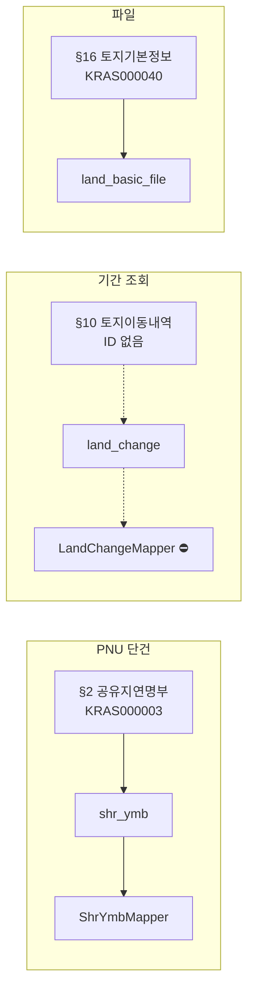

# KRAS 연계 서비스 레지스트리 — 연결 관계 단일화 설계

작성일: 2026-10-07
상태: **설계안(미구현)**. 현재 상태는 `kras-service-catalog.md`, 매퍼 코드, `GatewayPaths.java`, DDL을 직접 대조해 확인한 것이다.

---

## 1. 목적

"규격 항목 하나가 서비스 ID, 매퍼, 데이터셋, 화면 카드, 승격 테이블 중 무엇에 연결되어 있는가"를
한 곳에서 보고, 그 연결이 코드 안에서 서로 어긋나지 않도록 만든다.

지금은 이 연결이 여러 파일에 손으로 흩어져 있어서, 하나를 바꾸면 나머지를 따로 고쳐야 하고
어긋나도 컴파일 오류가 나지 않는다.

## 2. 현재 상태 (규격 16개 항목 기준)

규격 번호는 `docs/reference/2026-09-18/kras.md` 목차와 같다. 상태는 카탈로그 기준이다.

| § | 규격 항목 | 서비스 ID | 데이터셋 | 매퍼 (`connSvcId`) | 경로 | 상태 |
|---|---|---|---|---|---|---|
| 1 | 토지(임야)대장 | KRAS000002 | `land_info` | `LandInfoMapper` (직접 작성) | PNU 단건 | ✅ 검증 |
| 2 | 공유지연명부 | KRAS000003 | `shr_ymb` | `ShrYmbMapper` | PNU 단건 | ✅ 검증 |
| 3 | 토지(건물) 존재 여부 | KRAS000101 | `land_bldg_check` | `LandBldgCheckMapper` | PNU 단건 | ✅ 검증 |
| 4 | 대지권등록부(건물조회) | **없음** | `collective_building` | `CollectiveBuildingMapper` (throw) | PNU | 🚫 ID 없음 |
| 5 | 대지권등록부(전유부조회) | **없음** | `collective_unit` | `CollectiveUnitMapper` (throw) | PNU + 드릴다운 | 🚫 ID 없음 |
| 6 | 대지권등록부 | **없음** | `land_right` | `LandRightMapper` (throw) | PNU + 드릴다운 | 🚫 ID 없음 |
| 7 | 토지이동연혁 | KRAS000006 | `land_mov_hist` | `LandMovHistMapper` | PNU 단건 | ✅ 검증 |
| 8 | 소유권변동연혁 | KRAS000007 | `own_rgt_hist` | `OwnRgtHistMapper` | PNU 단건 | ✅ 검증 |
| 9 | 집합건물소유권연혁 | **없음** | `unit_ownership_history` | `UnitOwnershipHistoryMapper` (throw) | 드릴다운 | 🚫 ID 없음 |
| 10 | 토지이동내역 | **없음** | `land_change` | `LandChangeMapper` (throw) | 기간 조회 | 🚫 ID 없음 |
| 11 | 소유권변경내역 | — | — | 없음 | — | 📄 규격서 오류 (§10 복사) |
| 12 | 집합건물소유권변경내역 | — | — | 없음 | — | 📄 규격서 오류 (§11 복사) |
| 13 | 건물통합정보 | **없음** | `integrated_building` | `IntegratedBuildingMapper` (throw) | PNU | 🚫 ID 없음 |
| 14 | 건물통합도면 | **없음** | `building_image` | `BuildingImageMapper` (throw) | PNU | 🚫 ID 없음 |
| 15 | SHAPE 다운로드 | KRAS000038 (+037 레이어목록) | `cadastral_file`, `usezone_file`, `layer_list` | 매퍼 없음 (파일 파이프라인) | 파일 | ✅ 검증 |
| 16 | 토지기본정보 다운로드 | KRAS000040 | `land_basic_file` | 매퍼 없음 (TXT 파이프라인) | 전체 파일 | ✅ 검증 |

요약: 16개 중 **검증 완료 7개**(1·2·3·7·8·15·16), **ID 없음 7개**(4·5·6·9·10·13·14), **규격서 오류 2개**(11·12).

추가로 확인된 사실:
- 카탈로그 전체 서비스 ID는 **24개**(KRAS 19 + KOREPS 5)다.
- KRAS 19개 중 **12개는 규격 16개 항목에 대응하지 않는다**: KRAS000011, 014~017, 025~027, 037, 039, 102~103. 이 중 014~027, 102~103은 태그명이 가설이다(`KrasSpecMapper`). 037·039는 규격 항목 밖의 파일 서비스다.

## 3. 문제

### 3.1 같은 사실이 최소 7곳에 따로 적혀 있다

| 위치 | 담고 있는 것 | 누가 고치나 |
|---|---|---|
| `docs/reference/.../kras.md` | 규격 번호·항목 (ID 칸은 비어 있음) | 규격서 |
| `docs/reference/.../kras-service-catalog.md` | 번호 ↔ ID ↔ 데이터셋 ↔ 상태 | 사람 (문서) |
| `GatewayPaths.java` | 데이터셋 slug ↔ ID (`/conn` 통로용) | 사람 |
| 각 매퍼의 `connSvcId()` | ID 문자열 하드코딩 | 사람 |
| `KrasSpecMapperConfig.java` | ID 하드코딩 (14개) | 사람 |
| `KrasSchemaController.java` | 데이터셋 코드·이름·그룹 하드코딩 | 사람 |
| `kras.sync_dataset` 시드 DDL | `service_code`, `contract_status` | 사람 (DDL) |
| `kras-db.html`, `api-test.html`, `file-download.html` | 카드·버튼·ID 텍스트 | 사람 (템플릿) |

### 3.2 "호출 가능 여부"의 진실원이 둘이다

- **DB**: `kras.sync_dataset.service_code`가 NULL인지로 판단한다.
- **Java**: `connSvcId()`가 `UnsupportedOperationException`을 던지는지로 판단한다.

두 곳이 어긋나도 아무 경고가 없다. 예를 들어 DB에 `service_code`를 넣어도 매퍼가 여전히 throw하면
호출이 막힌다. 반대로 매퍼에 ID를 채워도 DB 계약 상태가 `UNVERIFIED`면 수집이 막힌다.

### 3.3 "검증 상태"가 문서와 코드에 따로 있다

카탈로그의 ✅/🧩/🚫 표시는 사람이 옮겨 적은 것이라, 코드 상태(`throw` 여부)나 DB 계약 상태
(`VERIFIED`)와 맞는지 자동으로 확인되지 않는다.

### 3.4 규격 번호와 코드 이름이 맞지 않는다

규격은 "§10 토지이동내역"이고 코드는 `land_change`, `LandChangeMapper`, `kras-db.html`의 `card-land-change`처럼
이름이 네 가지다. 사람이 번호에서 카드까지 따라가려면 여러 문서를 열어야 한다.

## 4. 설계

### 4.1 단일 레지스트리

서비스 한 개당 레코드 하나를 **한 파일**에 둔다. 권장 위치는 `src/main/resources/kras/services.yml`이다.

```yaml
- spec_no: 10                       # kras.md 목차 번호 (규격 기준). 없으면 null
  name: 토지이동내역
  service_id: null                  # 미확정이면 null. 확정되면 KRAS0000xx
  dataset_code: land_change
  path: DATE_RANGE                  # PNU | DATE_RANGE | DRILLDOWN | FILE_SHP | FILE_TXT
  mapper: LandChangeMapper          # 매퍼 클래스 (없으면 null)
  promotion_tables: [kras.land_change_event]
  verification: UNVERIFIED          # UNVERIFIED | HYPOTHESIS_TAGS | VERIFIED
  ui_card: card-land-change         # 화면 카드 id (없으면 null)
  gateway_slug: null                # /conn 통로 slug (있으면)
  max_query_days: 10
  depends_on: []                    # 드릴다운 선행 데이터셋
```

- `service_id`가 null이면 **호출 불가**로 본다. 이 값 하나가 진실원이다.
- `verification`은 DB 계약 상태와 같은 값을 쓴다. DB에는 이 값을 복사해서 넣는다.
- 규격 번호가 없는 항목(예: KRAS000014)도 `spec_no: null`로 같은 파일에 등록한다.

### 4.2 파생물은 전부 레지스트리에서 만든다

| 파생물 | 만드는 방법 | 손으로 고치나? |
|---|---|---|
| 매퍼의 `connSvcId()` | 레지스트리 조회 (`service_id`가 null이면 throw는 공통 로직이 처리) | 아니오 |
| `KrasSpecMapperConfig`의 ID | 레지스트리 조회 | 아니오 |
| `GatewayPaths` | 레지스트리의 `gateway_slug` 목록 | 아니오 |
| `kras.sync_dataset.service_code`, `contract_status` | 시드 갱신 시 레지스트리 값을 복사 | 아니오 |
| 화면 데이터셋 목록 (`KrasSchemaController`) | 레지스트리 조회 | 아니오 |
| 카탈로그 `kras-service-catalog.md` §2 표 | 빌드 시 생성해 `docs/`에 쓰기 | 아니오 |
| 연결도 (아래 4.4) | 같은 생성 과정 | 아니오 |

`connSvcId()` 자체를 없애기보다, 매퍼가 `ServiceRegistry.serviceIdOf(datasetCode)`를 호출하도록 바꾼다.
`service_id`가 null이면 기존과 같이 `UnsupportedOperationException`을 던진다. 그래서 동작은 같고,
판단 근거만 한 곳으로 모인다.

### 4.3 일관성 테스트 (빌드를 깨뜨리는 쪽으로)

`ArchUnit` 또는 단위 테스트로 아래를 검사한다. 기존 `PackageArchitectureTest`처럼 실패하면 빌드가 깨진다.

1. 레지스트리의 `dataset_code`는 모두 고유하다.
2. `service_id`가 있는 항목은 `gateway_slug` 또는 `mapper` 중 하나 이상과 연결되어 있다 (고아 ID 금지).
3. `service_id`가 null인 항목의 `mapper`는 `connSvcId()`에서 throw하는 것으로 확인된다 (거짓 호출 가능 금지).
4. `verification=VERIFIED`인 항목은 `service_id`가 있어야 한다.
5. `ui_card`로 지정된 id가 템플릿 HTML에 실제로 존재한다.
6. 시드 DDL의 `service_code`와 레지스트리 `service_id`가 같다.

테스트 5와 6은 템플릿·DDL 텍스트를 읽어 비교하는 방식이면 충분하다.

### 4.4 연결도 생성

레지스트리에서 아래 형식의 Mermaid 도식을 생성해 `docs/reference/`에 둔다. GitHub 마크다운에서 바로 보인다.



실선은 호출 가능, 점선은 ID 미확정(호출 불가)이다. 생성 시 상태에 따라 선 모양을 바꾼다.
위 예시는 형식만 보여준다. 전체 16개와 드릴다운 의존(`depends_on`)까지 생성한다.

### 4.5 화면 반영 (선택)

`/kras-db`에 "연계 현황" 탭을 추가해 레지스트리 표를 그대로 보여준다. 열 구성은
`§ / 규격 항목 / ID / 데이터셋 / 경로 / 검증 / 호출 가능`이다. 마크다운 문서를 열지 않아도 된다.
이 탭은 레지스트리만 읽으므로 DB 상태와 어긋나면 "DB 계약 상태" 열을 따로 표시해 차이를 드러낸다.

## 5. 마이그레이션 단계

| 단계 | 작업 | 위험 |
|---|---|---|
| 1 | `services.yml` 작성 (현재 문서와 코드에서 값 옮기기, 24개 ID + 규격 16개) | 낮음 — 읽기만 함 |
| 2 | 일관성 테스트 추가 (4.3) — 현재 상태가 통과하는지 확인 | 낮음 — 실패하면 어긋난 곳을 고친다 |
| 3 | `ServiceRegistry` 조회 클래스 추가, 매퍼 `connSvcId()`가 레지스트리를 쓰도록 변경 | 중간 — 동작은 같아야 함 |
| 4 | `GatewayPaths`, `KrasSpecMapperConfig`를 레지스트리 조회로 교체 | 중간 — `/conn` 운영 경로이므로 신중히 |
| 5 | DDL 시드 갱신 스크립트를 레지스트리 값에서 생성 | 중간 — 운영 DB 영향 |
| 6 | 카탈로그 문서·연결도 생성 | 낮음 |
| 7 | (선택) "연계 현황" 탭 | 낮음 |

단계 1~2까지만 해도 "어긋난 곳"이 자동으로 드러난다. 그것만으로도 가치가 크므로 먼저 한다.

## 6. 확인 필요

| ID | 확인 내용 | 이유 |
|---|---|---|
| R-1 | `GatewayPaths`의 slug와 카탈로그 "데이터셋" 열이 1:1인지 | 마이그레이션 시 매핑 기준이 된다 |
| R-2 | `api-test.html`이 쓰는 ID 목록이 `GatewayPaths`와 같은지 | 두 목록 중 정답을 정해야 함 |
| R-3 | 운영 DB의 현재 `service_code` 값 (실제 채워진 상태) | 시드 갱신 전에 차이를 알아야 함 |
| R-4 | 규격 번호가 없는 KRAS000014~027, 102~103의 출처 | 가설 태그 항목의 근거 문서 확인 |

## 7. 범위 밖

- 실제 API 응답 검증 (태그명 가설 14개) — 레지스트리는 `verification` 열로 상태만 표시한다.
- 새 서비스 ID 찾기 — 담당자 확인이 필요하다.
- 승격 로직 자체 변경 — 연결 관리만 다룬다.

## 8. 결정이 필요한 것

1. **레지스트리 위치**: `src/main/resources` (런타임에 읽음) vs `docs/` (사람이 읽는 원본). 제안은 `src/main/resources`.
2. **생성 방식**: 빌드 시점 생성 vs 테스트에서 검사만. 제안은 검사만 먼저 하고, 생성은 나중에.
3. **마이그레이션 순서**: 4번(GatewayPaths 교체)을 1~3 이후로 미룰지. 운영 `/conn` 경로이므로 제안은 미룬다.
